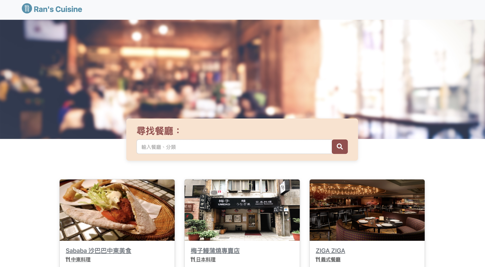

# Ran's Cuisine (Express project)

## 專案畫面


&emsp;


## 專案介紹

使用 Express 打造的餐廳美食網站，可以瀏覽餐廳、查看詳細資訊、甚至連結到地圖。

### 功能

- 查看所有已收錄的餐廳
- 瀏覽餐廳的詳細資訊
- 快速連結餐廳地址至 Google Map
- 透過關鍵字搜尋餐廳
- 新增想要收錄的餐廳
- 編輯餐廳資訊

## 開始使用

1. 請先確認有安裝 node.js 與 npm
2. clone 此專案到本地
3. 在本地透過終端機進入資料夾，輸入：
    
  ``` bash
  npm install
  ```

4. 安裝完成後，輸入：

  ``` bash
  npm run start
  ```

5. 若看見此行訊息則代表順利運行：

  ``` bash
  Express is listening on localhost:3000
  ```

6. 使用瀏覽器，進入以下網址：

  ```
  http://localhost:3000
  ```

7. 停止使用：

  ``` bash
  ctrl + c
  ```

## 開發工具

- Node.js 14.16.0
- Express.js 4.18.2
- Express-Handlebars 3.0.0
- Boostrap 5.2.3
- Popper.js 2.11.6
- Font-Awesome 6.3.0